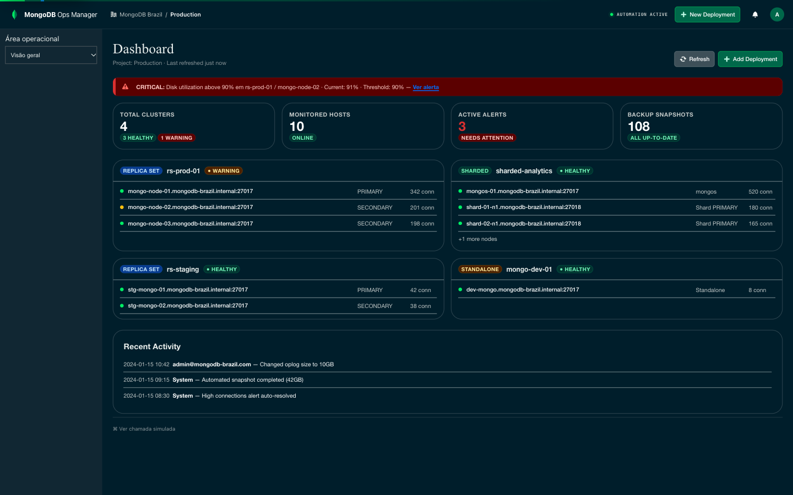
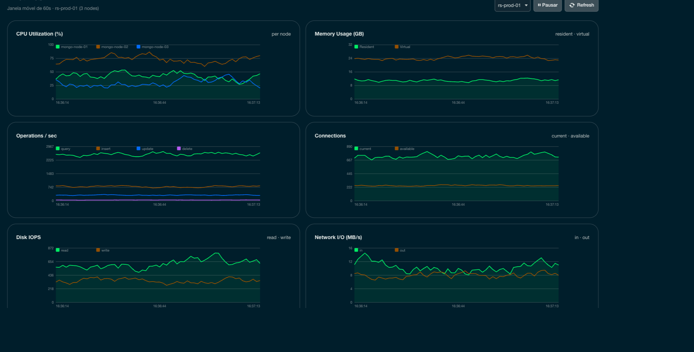
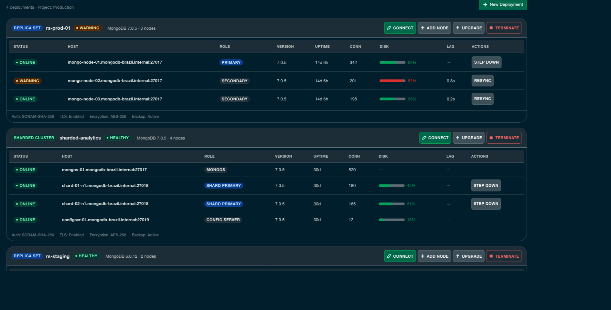
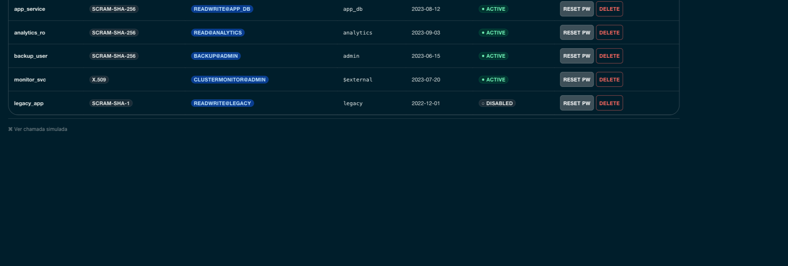

<div align="center">

# MongoDB Ops Manager — Interactive PoV

**A fully interactive simulation of MongoDB Ops Manager** (no real Ops Manager behind it), built with
MongoDB's LeafyGreen Design System and a Python backend.

Created to support MongoDB Enterprise Advanced positioning in Brazil. This
public overview is in English; the PoV interface and presentation-specific
documentation remain in Brazilian Portuguese.


-001E2B)

### [Open the live demo](https://adrianofratelli-glitch.github.io/mongodb-ops-manager-demo/)

*Runs directly in the browser in mock mode, with no backend or installation required.*

</div>



| Live metrics (60-second window) | Deployments and node lifecycle |
|---|---|
|  |  |



---

## Run it

**Live demo:** https://adrianofratelli-glitch.github.io/mongodb-ops-manager-demo/

**Full local stack with the Python backend** (Python 3.11+ and Node 20+):

```bash
python3 -m venv backend/.venv
backend/.venv/bin/pip install -r backend/requirements.txt
(cd frontend && npm ci)

./start.sh           # optimized build, opens http://127.0.0.1:5377
POV_DEV=1 ./start.sh # development mode with HMR
POV_NO_OPEN=1 ./start.sh # do not open the browser
```

The launcher starts the backend on `127.0.0.1:8077` and the frontend on
`127.0.0.1:5377`. If either port is already in use it stops with an error and
leaves the existing process alone. It never installs dependencies, so run the
setup above once before a presentation.

**Reset:** there is no database. All state lives in memory and comes from
`frontend/src/api/seed.json` (shared by the backend and the GitHub Pages mock).
*Project Settings → Reset Demo* (`POST /api/reset`) or restarting the backend
returns everything to that seed, including in-flight upgrades and restores.

**Publish a new live-demo version:**

```bash
./deploy-pages.sh   # static mock build → GitHub Pages
```

See [ARCHITECTURE.md](ARCHITECTURE.md) for architecture, endpoints, and manual
execution.

> **Two modes:** GitHub Pages uses a zero-cost mock with data embedded in the
> frontend. When run locally with `./start.sh`, the frontend uses the real
> FastAPI backend, which is better suited to technical architecture demos.
> Both modes read the same seed and are held to the same rule scenarios.

---

## Tests

```bash
backend/.venv/bin/pip install -r backend/requirements-dev.txt
backend/.venv/bin/pytest -q backend/tests      # FastAPI: rules, reset, hostile input, concurrency
(cd frontend && npm run test:parity)            # same scenarios against the GitHub Pages mock

# UI end-to-end without opening a port (Playwright serves the build itself)
(cd frontend && npx vite build --outDir /tmp/opsm-dist-real && node tests/e2e_ui.mjs bridge /tmp/opsm-dist-real)
(cd frontend && VITE_USE_MOCK=1 npx vite build --outDir /tmp/opsm-dist-mock && node tests/e2e_ui.mjs mock /tmp/opsm-dist-mock)
```

`backend/tests/scenarios_adversarial.json` describes out-of-order actions
(restore without a backup, upgrade during an upgrade, resync of a standalone),
double clicks, and two-tab conflicts; it runs against both the FastAPI backend
and the mock. The backend suite also covers malformed and 1 MB bodies,
operator-injection payloads (`{"$gt": ""}`), unicode/zero-width/RTL names,
32 parallel requests on the same resource, and a test proving that state after
many actions plus `POST /api/reset` equals the initial state. The `bridge` E2E
drives the real UI build against the real FastAPI app in process (two full demo
runs from reset, 360/768/1440 px layouts, `prefers-reduced-motion`).

## What is simulated, and which rules are real

**Everything is simulated.** There is no Ops Manager installation, no MongoDB
process and no agent behind this demo: every number, duration and action lives
in memory (FastAPI or the browser mock), and the top bar says so on every
screen. The demo is **not evidence of product performance or results**; it
shows the operator experience and the order in which Ops Manager allows things
to happen.

What *was* checked is the set of refusals below, against official MongoDB
documentation (read on 2026-10-09). "Literal" means the page states the rule;
"inferred" means the page describes the mechanism and the demo picks the
refusal that follows from it.

| Rule enforced by the demo | Basis | Source |
|---|---|---|
| Upgrades go one release series at a time (6.0 → 7.0 → 8.0) | Literal | [Upgrade a Replica Set to 8.0](https://www.mongodb.com/docs/manual/release-notes/8.0-upgrade-replica-set/) |
| Version changes are rolling, one process at a time, and block resync, step down, add node and a second upgrade while they run | Inferred (Automation applies one goal state per deployment) | [Change the Version of MongoDB](https://www.mongodb.com/docs/ops-manager/current/tutorial/change-mongodb-version/) |
| Downgrade is refused | Simplification: Ops Manager allows a downgrade within the same FCV; the demo refuses all downgrades and says why | [Change the Version of MongoDB](https://www.mongodb.com/docs/ops-manager/current/tutorial/change-mongodb-version/) |
| A standalone has no continuous backup or point-in-time restore | Literal (no oplog) | [FAQ: Backup and Restore](https://www.mongodb.com/docs/ops-manager/current/reference/faq/faq-backup/) |
| A member in `STARTUP2` (initial sync) is never elected primary | Literal | [Replica Set Member States](https://www.mongodb.com/docs/manual/reference/replica-states/) |
| Restore requires a snapshot, a point inside the PIT window and a target with the same topology; sharded restores cover all shards | Literal | [Restore Overview](https://www.mongodb.com/docs/ops-manager/current/tutorial/nav/restore-overview/) |
| While a restore runs, its target cannot be terminated, upgraded or changed (add node, step down, resync) | Inferred: an automated restore removes all data on the target and rewrites it through Automation | [Restore Overview](https://www.mongodb.com/docs/ops-manager/current/tutorial/nav/restore-overview/) |
| While a restore runs, its source cannot be terminated and its snapshot cannot be deleted | Inferred: removing a deployment from Ops Manager deletes its snapshots | [Stop Managing and/or Monitoring One Deployment](https://www.mongodb.com/docs/ops-manager/current/tutorial/unmanage-deployment/) |
| A restore job that loses its source or target ends `failed` with a reason, never `completed` | Inferred: restore jobs end `FINISHED`, `BROKEN` or `KILLED` | [Troubleshoot Backup and Restore Failures](https://www.mongodb.com/docs/manual/troubleshooting/backup-restore-failures/) |

Durations (3 s per upgraded process, 9 s restore, 25 s initial sync) are demo
timings, not product measurements. Rules not listed here (alert thresholds,
Performance Advisor figures, agent versions) are illustrative only.

---

## What the PoV covers

The React interface uses MongoDB's LeafyGreen components and data provided by a
FastAPI backend. Actions have coherent simulated effects: provisioning creates
a cluster, termination removes it, and counters update.

State stays consistent across modules. Provisioning registers agents for the
new nodes; termination removes those agents and closes the cluster alerts; and
resynchronizing a secondary moves it into `STARTUP2` while CPU, replication lag,
and IOPS rise until the node recovers automatically.

| Module | Demonstrated capability |
|---|---|
| **Dashboard** | Fleet overview, alerts, and cluster status |
| **Deployments** | Replica sets, sharded clusters, standalone deployments, and lifecycle actions |
| **Automation** | Pending changes with apply/discard and history |
| **Agents** | Inventory, per-host logs, upgrades, and CSV export |
| **Metrics** | Eight live charts over a moving 60-second window |
| **Performance Advisor** | Index recommendations and slow-query analysis |
| **Real-Time** | Per-cluster live operations and a functional `killOp` simulation |
| **Backup / Restore** | Snapshots and point-in-time recovery |
| **Alerts** | Open/closed views, settings, and one-hour acknowledgement |
| **Security** | Users, RBAC, authentication options, IP access list, and audit log |
| **Activity / Settings** | Event feed and deterministic demo reset |

---

## Stack

| Layer | Technology |
|---|---|
| Frontend | React, Vite, and [LeafyGreen UI](https://www.mongodb.design/) |
| HTTP | Axios |
| Backend | Python and FastAPI with in-memory state |

## Scope and disclaimer

This is a visual and educational PoV. It uses synthetic in-memory data and does
not connect to a real Ops Manager installation. MongoDB, Ops Manager, and
Enterprise Advanced are trademarks of MongoDB, Inc.

## License

MIT, see [LICENSE](LICENSE).
